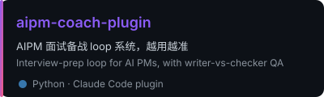
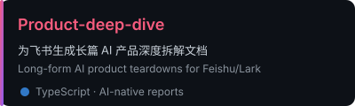
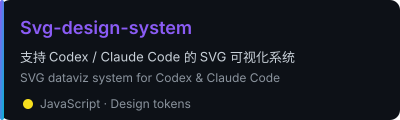
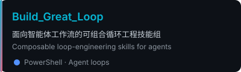
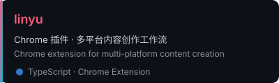

<!-- ╭──────────────────────────────────────────────────────────╮ -->
<!-- │              🌈  LOCAL BANNER (fast)  🌈                  │ -->
<!-- ╰──────────────────────────────────────────────────────────╯ -->


<!-- ╭──────────────────────────────────────────────────────────╮ -->
<!-- │                  ⚡ TYPING HEADER ⚡                       │ -->
<!-- ╰──────────────────────────────────────────────────────────╯ -->

<div align="center">

[](https://git.io/typing-svg)


<a href="https://github.com/VioletScar-Hui?tab=followers"></a>


</div>

<!-- ╭──────────────────────────────────────────────────────────╮ -->
<!-- │                    👋 ABOUT ME 👋                         │ -->
<!-- ╰──────────────────────────────────────────────────────────╯ -->

##  关于我 · About Me

```ts
const violetScar = {
  role:     "AIPM · AI 产品经理",
  identity: "会写代码的产品经理 × 懂产品的建造者",
  stack:    ["TypeScript", "JavaScript", "Python", "PowerShell"],
  building: ["Agent skills", "Loop harnesses", "Design systems"],
  motto:    "构建好用的工具，让 AI 真正帮上忙 — Build tools that make AI useful.",
};
```

- 🎯 我是 **AIPM（AI 产品经理）**，也是一个**自己动手造工具的 PM** — 把产品判断直接变成可运行的 Agent 工具。
- 🧩 在做 **Claude Code / Codex Skills**、**Loop Engineering**（可复用的智能体循环）与 **SVG 数据可视化**。
- 🛠️ I build agentic tools as a PM — skills, loop harnesses & design systems for Claude Code / Codex.
- 🌱 持续修炼 **agent orchestration & AI-native 工作流设计**。
- 💬 欢迎聊 AI 工具、智能体设计、产品拆解 · Happy to chat about AI tooling, agents & product teardowns.

<br/>

<!-- ╭──────────────────────────────────────────────────────────╮ -->
<!-- │                  🌀 NOW · 我在做什么                      │ -->
<!-- ╰──────────────────────────────────────────────────────────╯ -->

## 🌀 我在做什么 · Now

| | |
|---|---|
| 🏗️ **Building** | [linyu](https://github.com/VioletScar-Hui/linyu) — 多平台内容创作的 Chrome 插件 |
| 🛠️ **Maintaining** | Claude Code / Codex skills 组：[loop engineering](https://github.com/VioletScar-Hui/Build_Great_Loop) · [svg-design-system](https://github.com/VioletScar-Hui/Svg-design-system) |
| 🎓 **Coaching** | [aipm-coach](https://github.com/VioletScar-Hui/aipm-coach-plugin) — 把每场面试变成可复盘、可沉淀的闭环 |
| ✍️ **Writing** | AIPM 社区分享 & [AI 产品深度拆解](https://github.com/VioletScar-Hui/Product-deep-dive) |

<br/>

<!-- ╭──────────────────────────────────────────────────────────╮ -->
<!-- │                🧰 TECH STACK 🧰                          │ -->
<!-- ╰──────────────────────────────────────────────────────────╯ -->

## 🧰 技术栈 · Tech Stack

<div align="center">

[](https://skillicons.dev)

</div>

<br/>

<!-- ╭──────────────────────────────────────────────────────────╮ -->
<!-- │              📊 GITHUB METRICS 📊                         │ -->
<!-- │  由 .github/workflows/metrics.yml 每日生成本地 SVG        │ -->
<!-- │  Generated daily into the repo to avoid Vercel outages    │ -->
<!-- ╰──────────────────────────────────────────────────────────╯ -->

## 📊 数据看板 · Metrics

<div align="center">


</div>

<br/>

<!-- ╭──────────────────────────────────────────────────────────╮ -->
<!-- │              ✨ FEATURED PROJECTS ✨                      │ -->
<!-- │  本地 SVG 卡片，不依赖 github-readme-stats               │ -->
<!-- ╰──────────────────────────────────────────────────────────╯ -->

## ✨ 精选项目 · Featured Projects

<div align="center">

<a href="https://github.com/VioletScar-Hui/aipm-coach-plugin">
  
</a>
<a href="https://github.com/VioletScar-Hui/Product-deep-dive">
  
</a>

<br/>

<a href="https://github.com/VioletScar-Hui/Svg-design-system">
  
</a>
<a href="https://github.com/VioletScar-Hui/Build_Great_Loop">
  
</a>

<br/>

<a href="https://github.com/VioletScar-Hui/linyu">
  
</a>

</div>

<br/>

<!-- ╭──────────────────────────────────────────────────────────╮ -->
<!-- │               🐍 CONTRIBUTION SNAKE 🐍                    │ -->
<!-- ╰──────────────────────────────────────────────────────────╯ -->

## 🐍 贡献蛇 · Contribution Snake

<div align="center">

<picture>
  <source media="(prefers-color-scheme: dark)" srcset="https://raw.githubusercontent.com/VioletScar-Hui/VioletScar-Hui/output/github-contribution-grid-snake-dark.svg" />
  <source media="(prefers-color-scheme: light)" srcset="https://raw.githubusercontent.com/VioletScar-Hui/VioletScar-Hui/output/github-contribution-grid-snake.svg" />
  
</picture>

</div>

<br/>

<!-- ╭──────────────────────────────────────────────────────────╮ -->
<!-- │                  📫 CONNECT 📫                            │ -->
<!-- ╰──────────────────────────────────────────────────────────╯ -->

## 📫 联系我 · Connect

<div align="center">

<a href="https://github.com/VioletScar-Hui">
  
</a>

<br/><br/>

<i>💡 "构建好用的工具，让 AI 真正帮上忙。" · "Build tools that make AI genuinely useful."</i>

</div>


